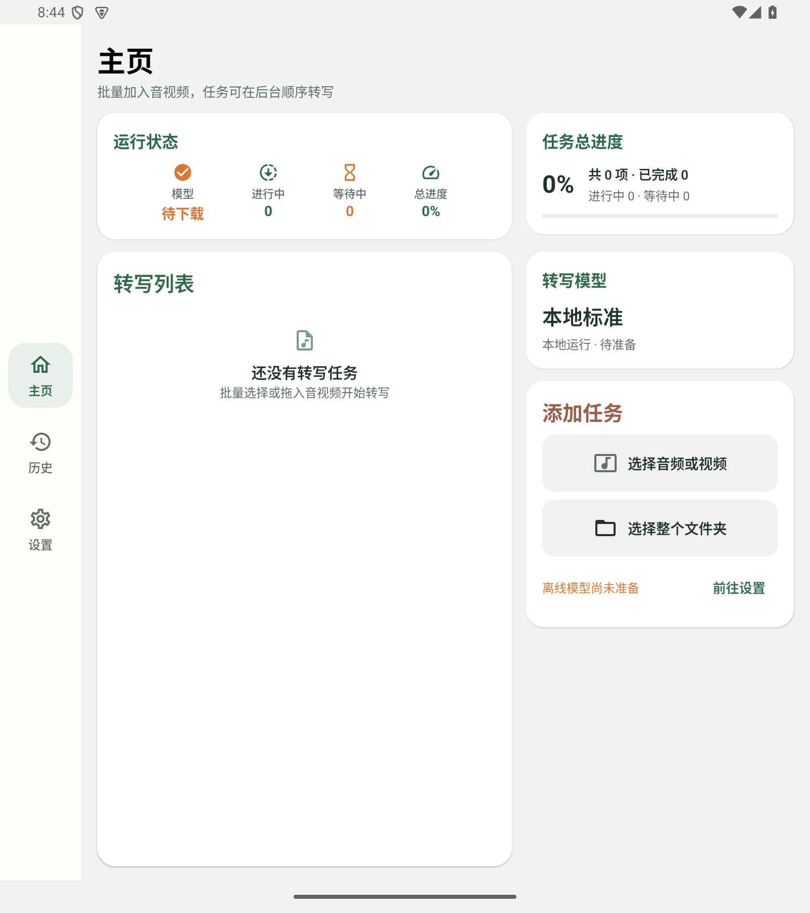
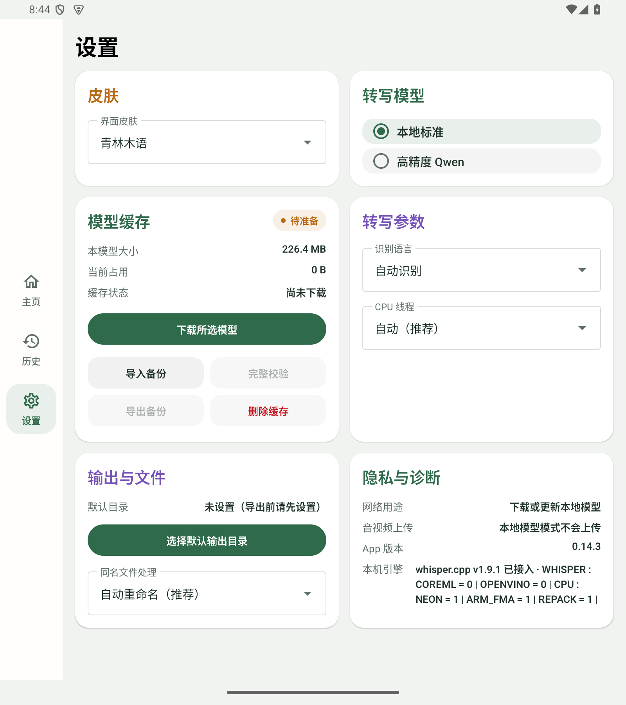
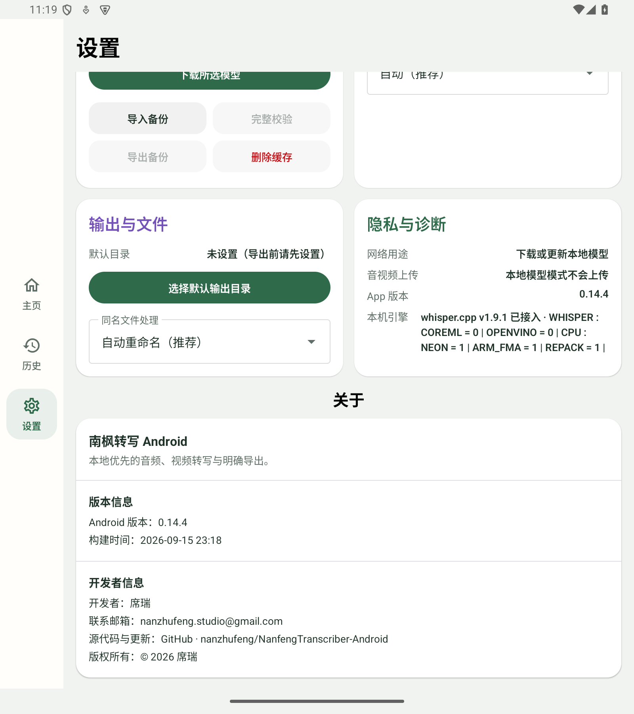

# 南枫转写 Android

音频、视频转写与明确导出。

## 下载

[下载正式版 v0.14.4](https://github.com/nanzhufeng/NanfengTranscriber-Android/releases/tag/v0.14.4)

安装包：`nanfeng-transcriber-android-v0.14.4.apk`

## 功能

- 本地标准 SenseVoice 与高精度 Qwen 转写。
- 按完整文件保存历史、调用记录与费用估算。
- 可编辑结果，支持 TXT、MD、SRT、DOCX 明确导出。

## 界面预览

API 35 隔离模拟器，展开视口 1600 × 1800，v0.14.4。

<table>
  <tr>
    <td align="center"> 主页</td>
    <td align="center"> 模型设置</td>
    <td align="center"> 设置与关于</td>
  </tr>
</table>
