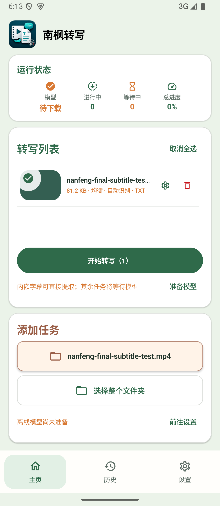
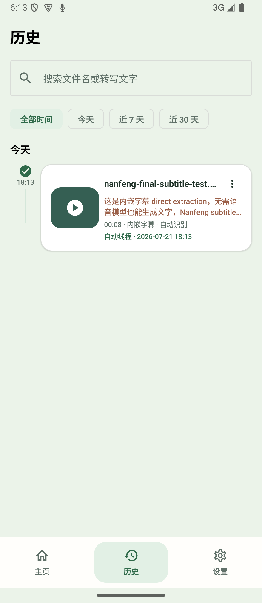
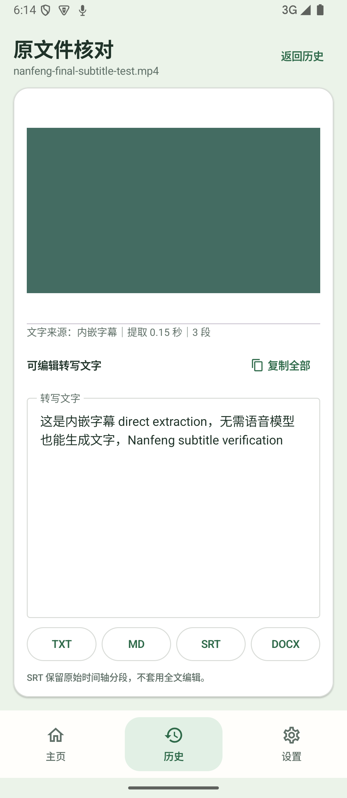
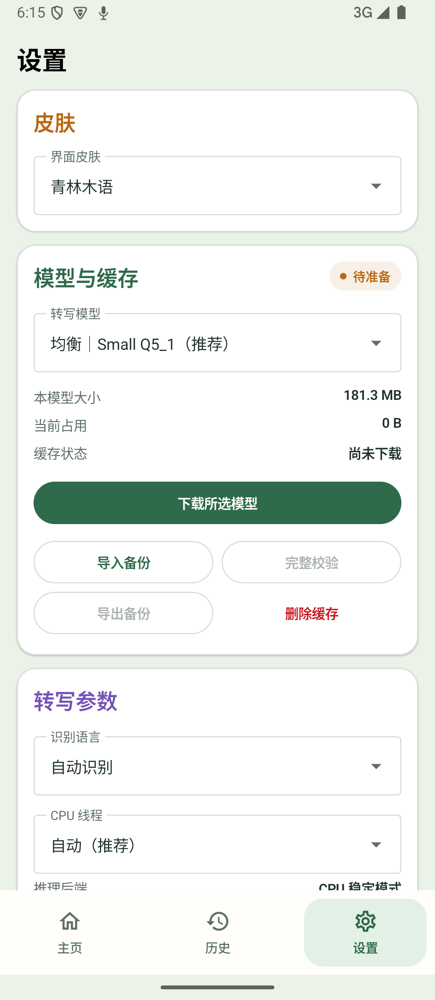

# 南枫转写 Android

> [!WARNING]
> **未完成品，开发已暂时搁置。** 当前版本的真实转写准确度仍不足，尤其是中英混合内容、专有名词和复杂音频。长音频稳定性、系统杀进程恢复和最终 OPPO 真机发布门禁也未全部通过。仓库仅供代码保存、学习和后续可能的继续开发，不建议当作稳定成品使用。

Windows 版“南枫转写”的独立 Android 正式项目。项目采用原生 Kotlin、Jetpack Compose 与 C++ 推理引擎，不把 Python/PySide6 桌面程序封装进 APK。

## 当前阶段

当前工作树的模型入口已收敛为两个明确选项：**本地标准：SenseVoiceSmall INT8 + sherpa-onnx**、**高精度：Qwen3-ASR API 直接转写**。Qwen 不是转写完成后的润色服务；选择它时会明确提示音频分段将发送至千问官方服务。设置页不展示服务地址或自由填写的模型名，API Key 仅以 Android Keystore 安全保存。调用记录按完整源文件聚合，并显示版本化的人民币费用估算。完整状态与验收边界见 [`docs/CURRENT_HANDOFF.md`](docs/CURRENT_HANDOFF.md)。

SenseVoice 模型权重不随 APK 分发；当前固定 ONNX 制品尚缺可归档的制品级许可，因此不得用于正式默认档或再分发。完整边界见 [`docs/model-license-status.md`](docs/model-license-status.md)。

## 下载未完成测试版

- [GitHub Release：南枫转写 Android v0.14.0（未完成／暂停开发）](https://github.com/nanzhufeng/NanfengTranscriber-Android/releases/tag/paused-development-v15)
- APK：`NanfengTranscriber-Android-v0.14.0-unfinished.apk`
- SHA-256：`ac132917c0763de48d8b58fb6ba420b6760d4b082e82a9e30440e85edca1e58e`

该 APK 只供测试和代码保存，安装前请先阅读上方未完成说明。

## 界面预览

以下为版本 15 在 API 35、`1140 × 2616 / 442dpi` 项目专用模拟器上的真实界面，不代表最终 OPPO 真机发布已通过。

<table>
  <tr>
    <td align="center"><br><sub>主页转写工作台</sub></td>
    <td align="center"><br><sub>历史时间线</sub></td>
  </tr>
  <tr>
    <td align="center"><br><sub>视频＋可编辑文字核对</sub></td>
    <td align="center"><br><sub>皮肤、模型与转写设置</sub></td>
  </tr>
</table>

## 构建

```bash
JAVA_HOME="/Applications/Android Studio.app/Contents/jbr/Contents/Home" \
ANDROID_SDK_ROOT="/Users/nanzhufeng/Library/Android/sdk" \
./gradlew testDebugUnitTest lintDebug lintVitalRelease assembleDebug assembleRelease
```

调试和 Release APK 的文件名固定为 `南枫转写.apk`。正式发布仍需隔离模拟器完整回归、OPPO 同签名覆盖、系统杀进程恢复、60 分钟/两小时长测和模型来源/许可证复核。
