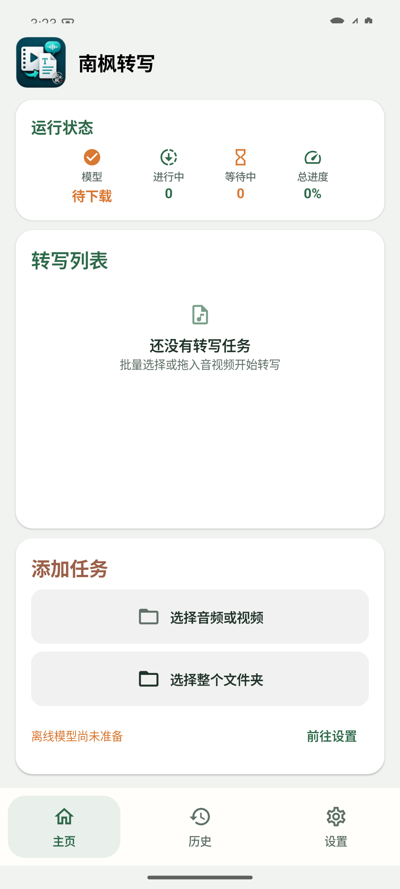
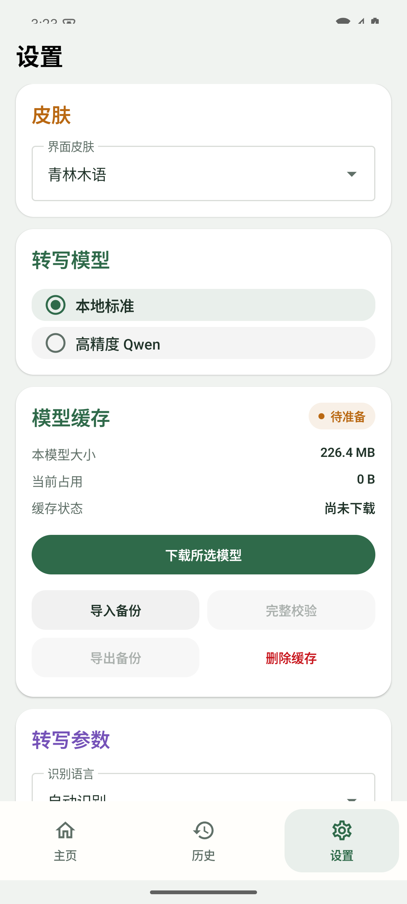

# 南枫转写 Android

音频、视频转写与默认目录导出。

## 下载

[下载正式版 v0.14.1](https://github.com/nanzhufeng/NanfengTranscriber-Android/releases/tag/v0.14.1)

安装包：`NanfengTranscriber-Android-v0.14.1.apk`

## 功能

- 本地标准 SenseVoice 与高精度 Qwen 转写。
- 按完整文件保存历史、调用记录与费用估算。
- 可编辑结果，支持 TXT、MD、SRT、DOCX 导出。

## 界面预览

API 35 隔离模拟器，v0.14.1。

<table>
  <tr>
    <td align="center"> 主页</td>
    <td align="center"> 模型设置</td>
  </tr>
</table>
