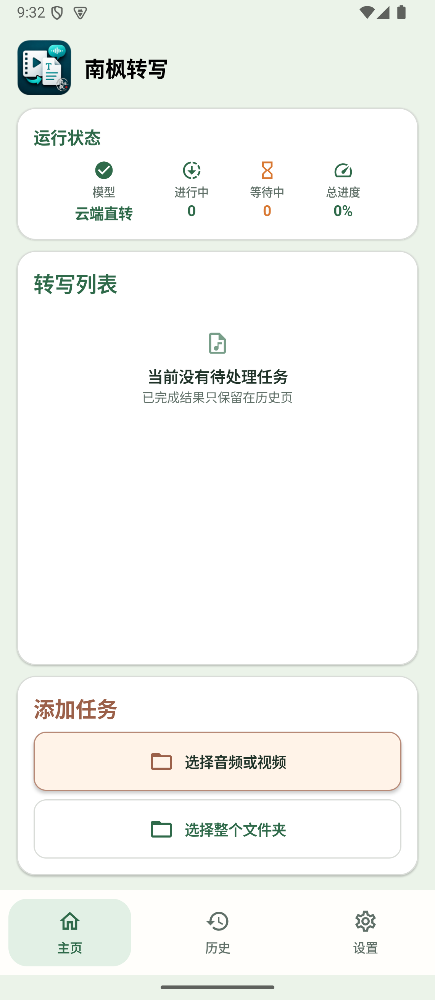
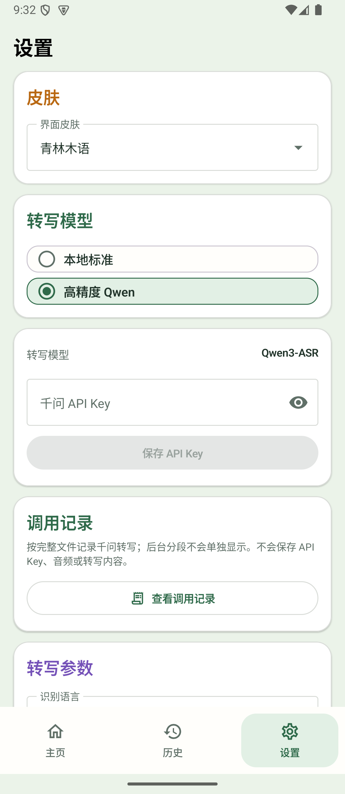

# 南枫转写 Android

南枫转写的 Android 正式版：在手机上把音频或视频转为可编辑文本，并按设置直接导出到默认目录。

## 下载

[下载正式版 v0.14.0](https://github.com/nanzhufeng/NanfengTranscriber-Android/releases/tag/v0.14.0)

安装包：`NanfengTranscriber-Android-v0.14.0-sensevoice-history-ui.apk`

## 功能

- 本地标准：SenseVoiceSmall INT8，模型下载一次后长期复用。
- 高精度 Qwen：使用 Qwen3-ASR 直接转写；API Key 仅保存在 Android Keystore。
- 历史记录：按完整文件保存转写结果、调用记录与费用估算。
- 结果核对：视频播放、可编辑转写文本，以及 TXT、MD、SRT、DOCX 导出。

## 界面

<table>
  <tr>
    <td align="center"> 主页</td>
    <td align="center"> 模型与调用记录</td>
  </tr>
</table>
